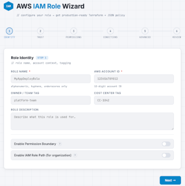

# AWS IAM Role Wizard

The AWS IAM Role Wizard is a web-based tool that makes it easy to create AWS IAM roles without needing to write any code. IAM (Identity and Access Management) roles are how you control what AWS services and users are allowed to do in your AWS environment — for example, allowing a server to read from S3, or letting a third-party application access specific resources in your account. Normally, creating these roles correctly requires writing complex policy documents by hand, which is time-consuming and error-prone. The wizard replaces that process with a simple step-by-step form.

You work through six straightforward screens: naming the role and tagging it for your records, choosing who or what is allowed to use it, selecting what permissions the role should have, setting security guardrails like MFA requirements or IP restrictions, configuring advanced options like session duration, and finally reviewing everything before generating. Once you click **Generate IAM Role Files**, the wizard automatically routes your configuration to the most appropriate Claude model.

Simple roles using managed policies and basic service trust are sent to Claude Haiku for faster turnaround, while more complex configurations involving inline policies, OIDC or SAML trust, cross-account access, deny rules, or resource-level scoping are sent to Claude Sonnet for its stronger reasoning on nuanced IAM logic — which then produces the finished role configuration files ready to hand off to your cloud or DevOps team for deployment. The AI is specifically instructed to follow AWS security best practices: no overly broad permissions, no hardcoded sensitive values, and comments throughout the files so your team can review and understand what has been generated.

The tool runs entirely in your web browser and requires no software installation. It is designed to be hosted internally by your IT or DevOps team on Vercel (a cloud hosting platform), after which anyone with the link can use it. Your AWS credentials and Anthropic API key are never exposed in the browser — they stay securely on the server side. Access can be restricted to specific IP ranges (such as your office network or VPN) so the tool is only reachable by staff on your corporate network, and an optional rate limit can be enabled to prevent excessive API usage.

---

## Prerequisites

- A [Vercel account](https://vercel.com/signup) (free tier works fine)
- An [Anthropic API key](https://console.anthropic.com/)
- [Node.js](https://nodejs.org/) installed locally
- [Git](https://git-scm.com/) installed locally

---

## Deploying to Vercel

Vercel is the hosting platform this tool is built to run on. Once deployed, it is accessible to your team via a standard web URL — no local installation required for end users.

Deployment is handled by a member of your IT or DevOps team and typically takes under 30 minutes. You will need a free Vercel account and an Anthropic API key (obtained from [console.anthropic.com](https://console.anthropic.com/)). The free Vercel tier is sufficient for normal internal use.

See **[DEPLOY.md](./DEPLOY.md)** for complete step-by-step deployment instructions, including how to securely configure your API key, restrict access to your corporate IP range, set up rate limiting, and troubleshoot common issues.
